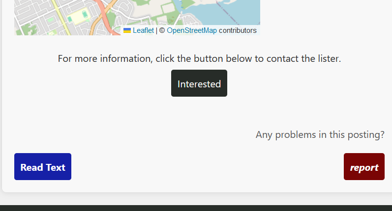
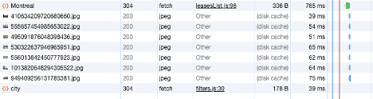
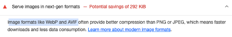
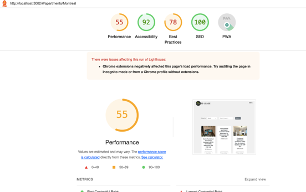
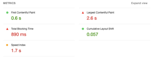
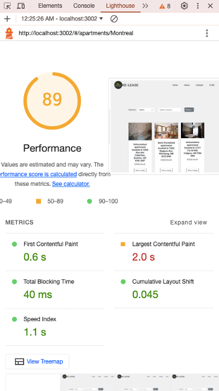

# Release-Project

Anastasia Bondarenko, Monica Dimitrova, Elissar Fadel, Dany Makhoul

## Champions

# Read Text Button Feature
Author: Anastasia Bondarenko

I created a read text button using SayButton component imported from say-react library in apartment information display to read all the text in post description. Integrating a SayButton enables users with visual impairments to access the content more conveniently by listening to the description of the apartment by clicking a button. Also, users that prefer auditory learning or multitasking can benefit from the addition of a SayButton: instead of having to read through the entire description, they can listen to it while performing other tasks, thus improving the overall user experience and engagement with the platform.

The button is a blue 'Read Text' button in the bottom-left of the apartment description.

# Mobile version
Author: Dany Makhoul
I added css rules and modified the layout where necessary to be mobile friendly

# Multi-language Feature
Author: Monica Dimitrova

I created a dropdown menu where a user can select their prefered language in which to browse our website.
I implement the translation of our website using json files for each language, and i18next is the internationalization framework I used.

# Time performance optimization 

Author: Elissar Fadel

In this champion, I addressed the issue of slow page loading in our application. The page load time was excessively slow, taking up to 4 seconds in some cases. This sluggish performance was particularly concerning given that our application does not handle a large dataset. To ensure a better user experience and improve user satisfaction, I focused on optimizing the page load time. In the next few paragraphs, I explain what features I used and show proof of optimization.

Features added for performance optimization:

### Frontend Caching: 
Used local storage to store data from fetch responses, ensuring less repeated API calls and improving responsiveness of the app. I cached responses from requests of filters and all leases, and ensured to remove from local storage items that correlate to a lease being uploaded, removed or updated. 

### Backend Caching: 
Used memory caching to store database data, ensuring less time for calls from database. I did the same as frontend caching where I removed the caching when updating, removing or uploading.

### Improved frontend fetching: 
Having two fetches at the same time when lease list is initially created made the load twice as slow (took 4s to load). I seperated the fetches by making lease fetch in the beginning of the page load and the city fetch when the filter button is clicked. It hanced the fetching of the data by a signifacnt difference, taking only a few ms!
Before: 
After: 

### Images: 
Having 100 images, there was an issue with the time of loading these resources. there are few optimization techniques I used for images:

- Lazy loading: used lazy loading on the images in the lease list as they were blocking the inital page load, this helped with reducing bandwidth usage.

- Switched to WebP format: the images from the db were jpn, so I converted all of them to webP, which is more compressed and smaller file size compared to jpn. This reduced image load time and bandwidth consumption which improved the page rendering 
Issue before: 

- Controlled caching for static images: used control caching and defined 30 days for caching for image types in the static resources in order to reduce the load time of the home page of our website.

### Remove unnecessary fetching: 
The leases page was fetching filtering options, I removed the fetch request and hardcoded the options of the filtering, because there were only furnished, unfurnished and semi-furnished as options and even in post listing, you could only choose one of the three, so this was not needed and created more blocking time for the initial load of the page.

### Overall, these features helped in improving the speed of the loading by twice as much and reducing the blocking time by 95.5% !!!

### Lighthouse report
Before: 

After: 
